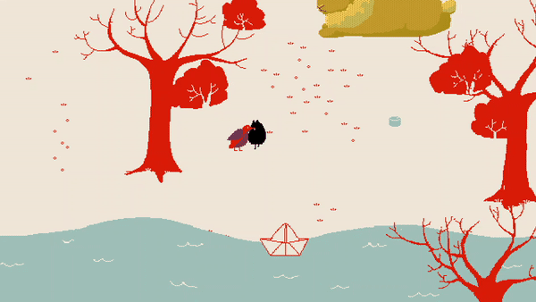

# Godot Dialog System
Open source feature-rich dialogue system in Godot, with an in game example.

[](https://www.youtube.com/watch?v=On1x586NZtM)

## Features
* Branching dialog
    * Show dialog depending on previous choices
* Conditional dialog
    * Show dialog and choices depending on in-game variables
	* Display custom variables in dialog text using special characters
* Execute actions with dialog
    * Easily shake screen, add and remove items from player inventory, and so on, all from the comfort of a single .json file
	* Emit signals as needed to play animations, sounds, and anything else you think would be necessary during dialog
* Easily customizable
    * Use of control nodes makes it easy to re-size, and use themes or textures of your choice to change the style of dialog
    * Possible to use different styles of dialog depending on the speaker
* Beautiful sound and voice 🔈
    * Separate voices database allows you to easily change voice per dialog
        * Typewriter style sound with simple modifications allows for a wide variety of sound with little effort
    * Button sounds are satisfying and responsive
* Animated character icons
* Uses RichText - compatable with BBCode for fun text styles
* Keyboard accessible
    * All dialog actions are navigatable by keyboard - no mouse needed!
* Scalable
    * Modifying dialog from a single .json file allows for dialog to be scalable to large sized games -- adding dialog takes no more effort than typing the dialog up (no game engine shenanigans needed!)
    * Optional parameters makes it simple to use for small games too

Includes an example of how the dialog system might work with a top-down RPG. However, it is easily used for other styles of games as well with minor to no modification, eg. visual novels, etc.

## Getting Started with Dialog
Navigate to `UI\dialog\dialog.tscn` to see how the dialog system works.

You add dialog to your game via .json file, currently stored in `Data\Dialogue.json`.

Three examples of adding dialog to your game:
```
"robust_text_id" : {
	"name": "Qin Tina", 
	"icon": "most_beautiful_being", 
	"voice": "sparkly",
	"text": ["This is the most feature-rich dialog with choices you can make.",
               "Don't you think this is so cool?!?"], 
	"choices": [ 
			{"text" : "Agreed.", "next" : "text_id_if_agree", "action": ["show confetti"]},
			{"text" : "Disagreed.", "next" : "text_id_if_disagree", "action": ["go to jail"],
                "show_only_if": "player status insane"}
		],
	"action" : ["screen shake", "play_sound cheering"]
	},

"conditional_text_id" : {
	"text": ["You can move to the next dialog text depending on in-game variables."], 
	"next": [{"id": "text_id", "if": "already talked"},
            {"id": "other_text_id", "if": "has 5 specific_items"},
            "fallthrough_text_id"],
	},

"simple_text_id": {
	"text": ["This is the simplest dialog you can make."]
	},
```

You can also create custom dialog in-game by creating dialog text in the format specified above and adding it to `db_dialog`, a database of all dialogs. This will allow for easier creation of dynamic text that might display in-game variables, but will need some set-up to generate the entry.

You can add in commonly used variables in dialog using reserved special characters. For instance, if the player name is John Smith:
```
"text_id": {
	"text": ["Hello, &."]
	},
```
will display in game as
```
Hello, John Smith.
```
You can also dynamically control text speed in a single dialog:
```
"text_id": {
	"text": ["I'm s|t|u|t|t|e|r|i|n|g. This ||| is a longer pause."]
	},
```
will add pauses where the reserved special character `|`.

Code is easily modifiable to change reserved character, and to add more special characters with custom behaviors.

## Getting Started with Voices
It is easy to create new typewriter-style voices yet there is a lot of nice variability in sound possible. You can make new voices using .json file:

```
"narrator" : {"rate" : 4, "pitch": 1.5, "pitch_range" : 0.2 },
"bird" : {"rate" : 4, "sound" : "chirp", "pitch": 1, "pitch_range" : 0.2 },
```

`rate` : The rate at which a sound is played counted in sound per letters + 1, such as every letter, or every 5th letter. Bigger rates lead to less frequently played typewriter sound.

`pitch` : The pitch at which to play the sound.

`pitch_range`: A random ± amount in which the pitch can fluctuate. Bigger pitch range leads to more natural song-like voices while lower pitch range sound more monotonous.

`sound` (optional): The sound to play in the typewriter effect, matching the name of the respective preloaded sound in the `dialogue_voice.gd` in `Dialog.tscn'. If no sound is specified, it uses a default sound.

## FAQ
### ❓ Why are you editing dialog via a .json file?
I find .json the fastest to edit and manipulate, since it's basically a text file. No need for graph nodes or other visual UI that gets cluttered when the game grows large. 

However, it is admittedly error-prone if you mistype something. Adding error-checking is something I plan on doing in the future.

I do understand editing dialogue via something more visual would be a nice feature though. There are many great visual dialogue editors available that output .json files:
* [Dialogue Designer](https://www.gamedev.net/projects/2382-dialogue-designer/)
* [Levrault Dialogue Editor](https://github.com/Levrault/LE-dialogue-editor)
* [Whiskers](https://github.com/littleMouseGames/whiskers)

Remember that all you really need is a .json file in the right format, so a dialogue designer for any game engine or story format that outputs to the correct format will work -- do not limit yourself to Godot.

While it may need some editing to work with my particular dialogue file, it is a good starting point. Please let me know if you would be interested in a visual editor for my dialogue system and I would be happy to look further into developing one suitable to use with this.

### ❓ Why did you show source code for a top-down RPG, rather than just the dialog system?
I wanted to show an example of how the dialog system may be used as part of a game, and how well it can integrate into game mechanics. It's easy to find open source dialog systems for Godot that shows you how to display text. The hard part is how you can make the dialog integrate well into your game, and respond to in-game conditions, without requiring a whole bunch of repetitive and extra code.

The code and files are also well separated and organized -- dialogue-system specific files are under `UI\dialog`. You are free to ignore the other code and peer into that only if you'd like.

### ❓ Why isn't this a plugin?!?!
Personally, I found project source files rather than plugins easier to understand and emulate when I just got started learning Godot. Plugins are also harder to fully customize/edit to your game style.

If you feel a plugin would be more useful, though, please message me and I will consider making one in the future if enough people are interested.

## License 📃 
The project is licensed under MIT license. Please feel free to use for your games, whether commercial or non-commercial! Just be sure to credit me!

```
Dialog system by Qin Tina
> Github (https://github.com/QueenChristina)
> Twitter
> Youtube
```

Exceptions:
* Music
    * The music is made by [Joshua McLean](https://joshua-mclean.itch.io), licensed under Creative Commons Attribution 4.0 International

## Acknowledgements and Resources
* [Dialogic](https://github.com/coppolaemilio/dialogic) 
	* My personal favorite, the most complete open source Godot dialog-system plugin out there. You can create and edit dialog from within the engine itself.
* [Game Endeavor](https://www.youtube.com/watch?v=Qh3U2cbH8DM&t=107s)
	* Insight into how Game Endeaver implemented their dialog system gave me insight into how I might execute actions during dialog.
* [Godot Open Dialogue by J. Sena](https://jsena42.bitbucket.io/god/)
	* I haven't personally looked at it in-depth, but it seems to have many great features

## Support Me ❤️
If you liked this project, or felt this was useful, please leave me a comment and feedback! It would really make my day.

And, if you ever make a game with this, I'd love a know! Please send me a link of your game so I can support it! <3
